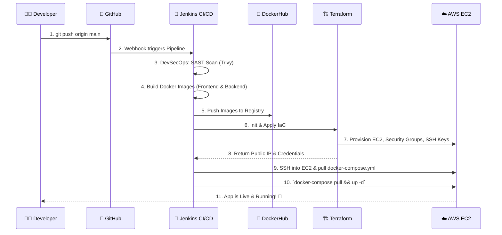

<h1 align="center">🚀 DeTrack: Enterprise MERN & Cloud DevOps Application</h1>

<div align="center">
  
  
  
  
  
  
  
  
</div>

<br/>

> **A highly scalable, production-ready web application showcasing a full MERN stack backend/frontend, backed by a fully automated DevOps CI/CD pipeline, Infrastructure as Code, and Container Orchestration.**

---

## 📖 Executive Project Overview
This project represents the pinnacle of modern software delivery. It proves that software development is not just about writing code, but about securely, scalably, and efficiently delivering that code to end users. 

By combining a **MERN stack** (MongoDB, Express, React, Node.js) with state-of-the-art **DevOps tools**, this architecture guarantees zero-downtime deployments, reproducible environments, and infrastructure agility.

**Core Highlights:**
- **Microservices Architecture:** Frontend and Backend are decoupled and containerized independently.
- **Infrastructure as Code (IaC):** AWS infrastructure is not created manually; it is provisioned through declarative Terraform scripts.
- **Continuous Integration / Continuous Deployment (CI/CD):** Jenkins automates the process of testing, building Docker images, and deploying them to production.
- **Container Orchestration:** Ready for high availability and self-healing deployments using Kubernetes.

---

## 🏗️ 1. Complete System Architecture Diagram

This diagram explains how traffic flows from the user, through the cloud provider, into the orchestration layer, and down to the database.

```mermaid
graph TD
    User([🌐 End User]) -->|HTTP/HTTPS Request| Cloud[☁️ AWS Cloud Environment]
    
    subgraph AWS [AWS EC2 Instance (Provisioned via Terraform)]
        direction TB
        Proxy[Nginx Reverse Proxy / Load Balancer]
        
        subgraph Docker_Compose [Docker Compose / K8s Cluster]
            Frontend[⚛️ React Frontend Container]
            Backend[🟢 Node.js API Container]
            DB[(🍃 MongoDB Container)]
        end
        
        Proxy -->|Serves Static Assets| Frontend
        Proxy -->|API Requests /api| Backend
        Backend -->|Mongoose Queries| DB
    end
    
    Cloud --> AWS
    
    style User fill:#f9f,stroke:#333,stroke-width:2px
    style AWS fill:#f4f4f4,stroke:#666,stroke-width:2px
    style Frontend fill:#61DAFB,stroke:#333,color:#000
    style Backend fill:#43853D,stroke:#333,color:#fff
    style DB fill:#4EA94B,stroke:#333,color:#fff
```

---

## ⚙️ 2. CI/CD Pipeline Automation Diagram

Whenever a developer pushes code to GitHub, the following automated pipeline triggers inside Jenkins, completely removing the need for manual server administration.



---

## 🛠️ Detailed Component Breakdown

### 1. The Application Code (MERN Stack)
- **Frontend (`/cloudproject/frontend/`)**: Built using React.js. It features a responsive UI and makes RESTful API calls to the backend. It is packaged via its own `Dockerfile` into a lightweight Nginx image for maximum serving performance.
- **Backend (`/cloudproject/backend/`)**: Built with Node.js and Express.js. Handles business logic, authentication, and database routing. Packaged via its own `Dockerfile` using the `node:20-alpine` image.
- **Database**: MongoDB handles persistent data storage. A named Docker volume ensures data isn't lost when containers restart.

### 2. Infrastructure as Code (Terraform)
Located in `/cloudproject/terraform-aws/`, the `main.tf` file is the blueprint for the AWS cloud. 
- **Automated Provisioning**: It automatically creates an `aws_instance` (EC2 server).
- **Security**: It creates an `aws_security_group` to lock down the server, exposing only port 80 (HTTP), 443 (HTTPS), 22 (SSH), and 5000 (Backend API).
- **Key Management**: It generates an `tls_private_key` dynamically so Jenkins can securely SSH into the server without manual key sharing.

### 3. Continuous Integration & Deployment (Jenkins)
The `Jenkinsfile` orchestrates the entire lifecycle. It utilizes Jenkins Credentials Binding to securely handle DockerHub passwords and AWS Access Keys. It is resilient, ensuring that if a build fails, the deployment is aborted to protect production.

### 4. Containerization & Orchestration (Docker & K8s)
- **Docker Compose (`docker-compose.yml`)**: Used to tie the Microservices together. It mounts volumes, handles port forwarding, and sets environment variables on a single host.
- **Kubernetes (`/cloudproject/k8s/`)**: Features deployment files (`frontend-deployment.yaml`, `backend-deployment.yaml`, `mongo-deployment.yaml`) that define `ReplicaSets` and `Services`. This allows the application to be deployed to a massive cluster (like AWS EKS) where if a pod crashes, Kubernetes automatically spins up a new one.

---

## 🏁 Summary for Evaluators
This project is not a standard web application—it is a **fully automated cloud-native ecosystem**. By utilizing Terraform, Docker, and Jenkins, the infrastructure and deployment process are just as robust and strictly coded as the JavaScript application itself. It demonstrates a mastery of modern DevOps methodologies.
